<p align="center">
  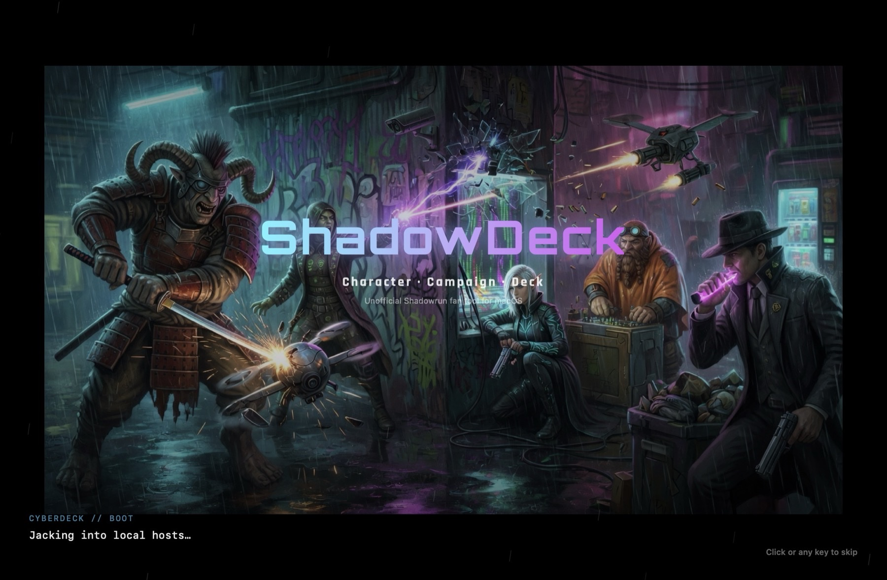
</p>

<h1 align="center">ShadowDeck</h1>

<p align="center">
  <strong>A native macOS campaign companion for Shadowrun</strong><br />
  Create runners · track missions · manage lifestyle &amp; karma · roll dice<br />
  for <strong>4th, 5th, and 6th edition</strong>
</p>

<p align="center">
  <a href="https://github.com/RcktMan77/ShadowDeck/releases"></a>
  
  
  
  
  <a href="https://github.com/RcktMan77/ShadowDeck/releases"></a>
</p>

<p align="center">
  <em>Unofficial fan project — not affiliated with or endorsed by Catalyst Game Labs or The Topps Company, Inc.</em>
</p>

---

## Table of contents

- [Why ShadowDeck?](#why-shadowdeck)
- [Tour](#tour)
- [Features](#features)
  - [Build a runner](#build-a-runner)
  - [Character library & play sheet](#character-library--play-sheet)
  - [Runs / mission tracker](#runs--mission-tracker)
  - [Rules Reference & PDF library](#rules-reference--pdf-library)
  - [Lifestyle, advancement & more](#lifestyle-advancement--more)
- [Getting started](#getting-started)
- [Tips for the table](#tips-for-the-table)
- [Roadmap](#roadmap)
- [For developers](#for-developers)
- [License & content](#license--content)

---

## Why ShadowDeck?

Chummer remains excellent for deep builds and data. **ShadowDeck is for running the campaign** — play sheets, runs, lifestyle, advancement, contacts, dice, and a **rules reference** with your own PDF shelf in one Mac-native app.

| | |
|:--|:--|
| **Status** | Active single-player development. Core campaign tools are usable at the table. Shared online / multi-user features are planned later. |
| **Editions** | Shadowrun **4e · 5e · 6e** |
| **Import** | Chummer JSON / `.chum5`, portable `.shadowdeck` packages |
| **Privacy** | Local-first. Your PDFs and library stay on your Mac. |

<table>
  <tr>
    <td width="25%" align="center" valign="top">
      <strong>Characters</strong><br />
      <sub>Multi-edition chargen, library, interactive play sheet, portraits</sub>
    </td>
    <td width="25%" align="center" valign="top">
      <strong>Runs</strong><br />
      <sub>Mission library, briefing, team, session log, awards</sub>
    </td>
    <td width="25%" align="center" valign="top">
      <strong>Dice</strong><br />
      <sub>Edition-aware hits &amp; glitches, Edge, house-rule toggles</sub>
    </td>
    <td width="25%" align="center" valign="top">
      <strong>Rules</strong><br />
      <sub>Mechanical cards + calculators; personal PDF shelf</sub>
    </td>
  </tr>
</table>

---

## Tour

<p align="center"><sub>Click a still for the full image</sub></p>

<table align="center">
  <tr>
    <td width="25%" align="center" valign="top">
      <a href="Screenshots/02-library.jpg">
        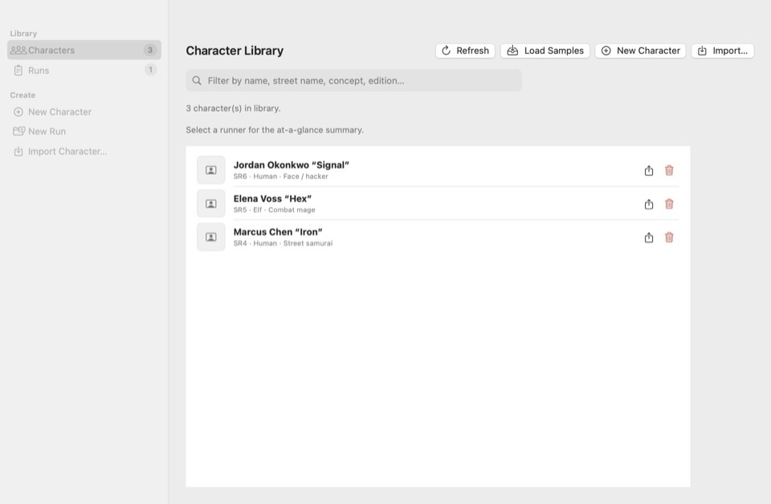
      </a><br />
      <sub><strong>Character Library</strong></sub>
    </td>
    <td width="25%" align="center" valign="top">
      <a href="Screenshots/03-generation-role.jpg">
        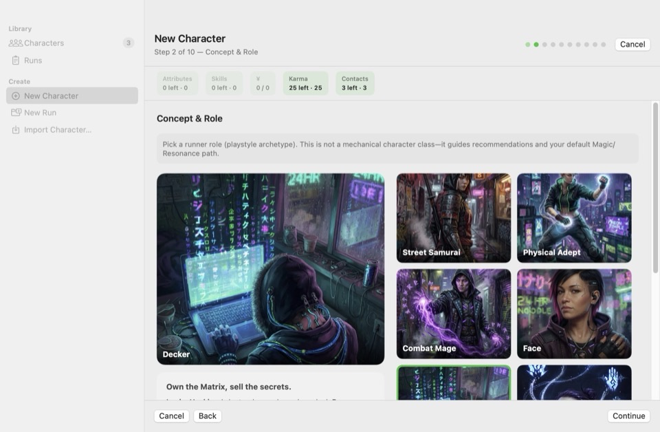
      </a><br />
      <sub><strong>New Character · Role</strong></sub>
    </td>
    <td width="25%" align="center" valign="top">
      <a href="Screenshots/04-character-sheet.jpg">
        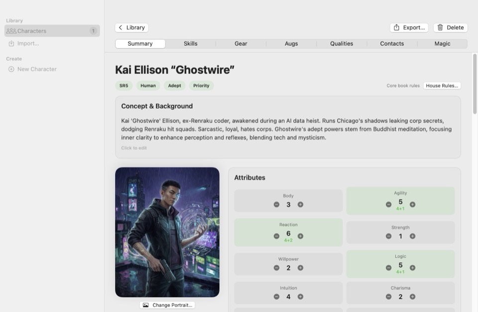
      </a><br />
      <sub><strong>Play sheet</strong></sub>
    </td>
    <td width="25%" align="center" valign="top">
      <a href="Screenshots/05-dice-roller.jpg">
        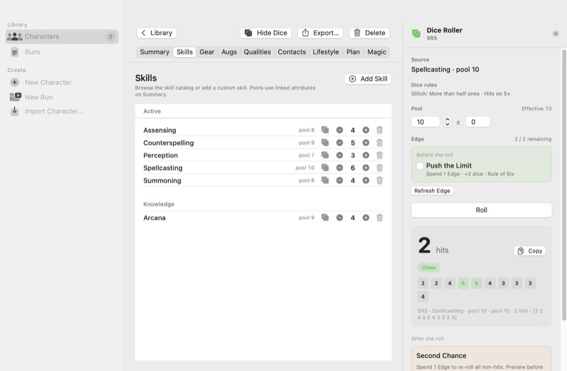
      </a><br />
      <sub><strong>Dice roller</strong></sub>
    </td>
  </tr>
  <tr>
    <td colspan="2" align="center" valign="top">
      <a href="Screenshots/06-rules-reference.jpg">
        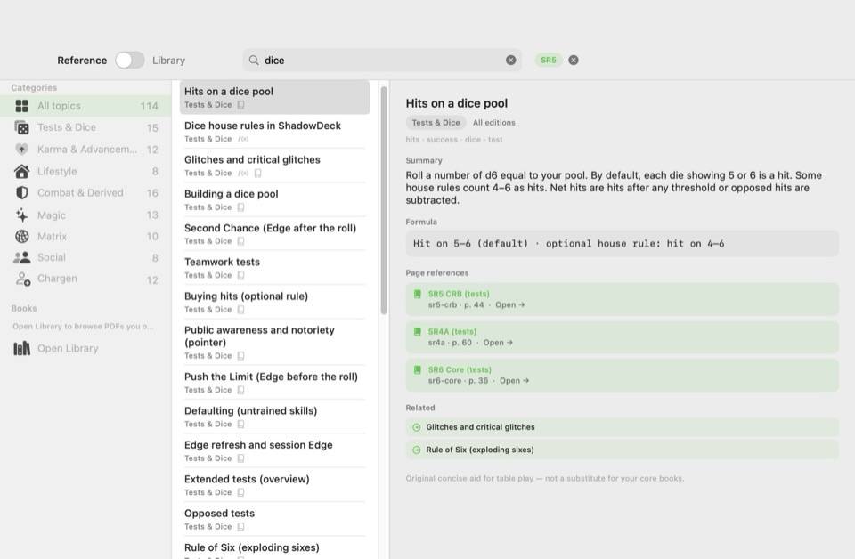
      </a><br />
      <sub><strong>Rules Reference</strong></sub>
    </td>
    <td colspan="2" align="center" valign="top">
      <a href="Screenshots/09-pdf-library.jpg">
        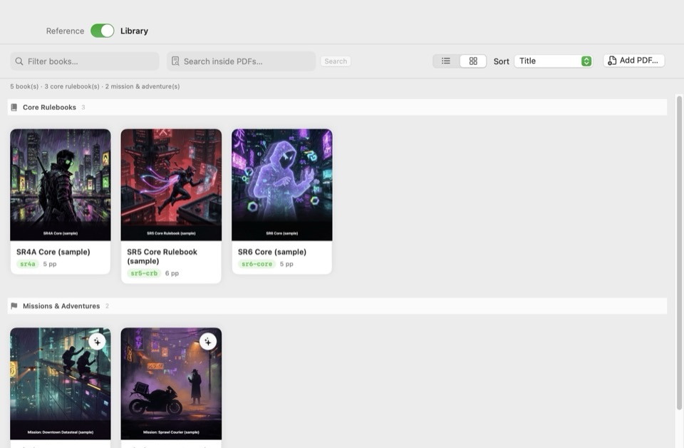
      </a><br />
      <sub><strong>PDF Library</strong></sub>
    </td>
  </tr>
</table>

<p align="center"><sub>Expand a poster to play a silent looping GIF</sub></p>

<table align="center">
  <tr>
    <td width="50%" align="center" valign="top">
      <details>
        <summary>
          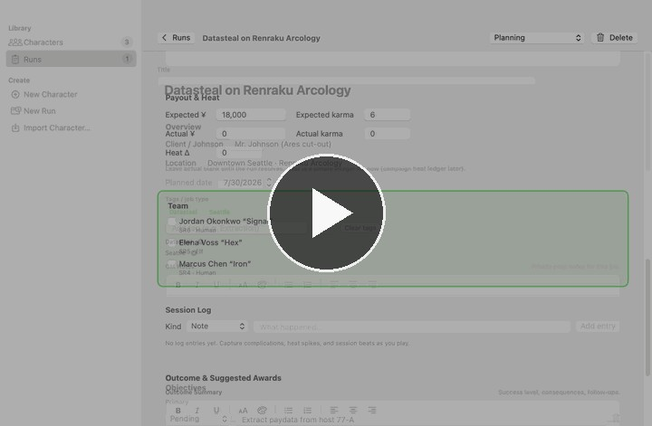<br />
          <sub><strong>▶ Run / mission flow</strong> — create a job, brief the team, log the session, complete objectives, set the outcome</sub>
        </summary>
        <p align="center">
          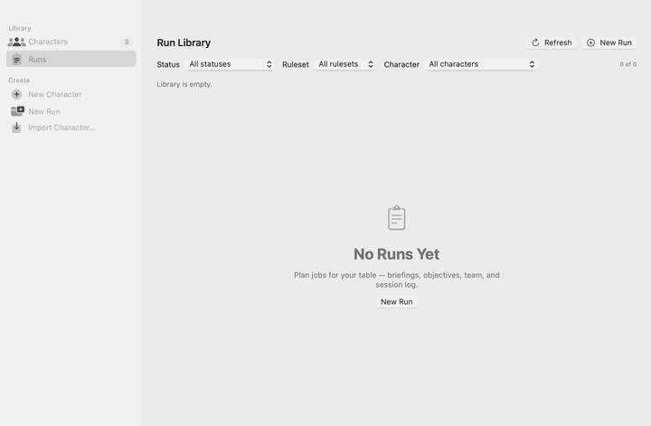
        </p>
      </details>
    </td>
    <td width="50%" align="center" valign="top">
      <details>
        <summary>
          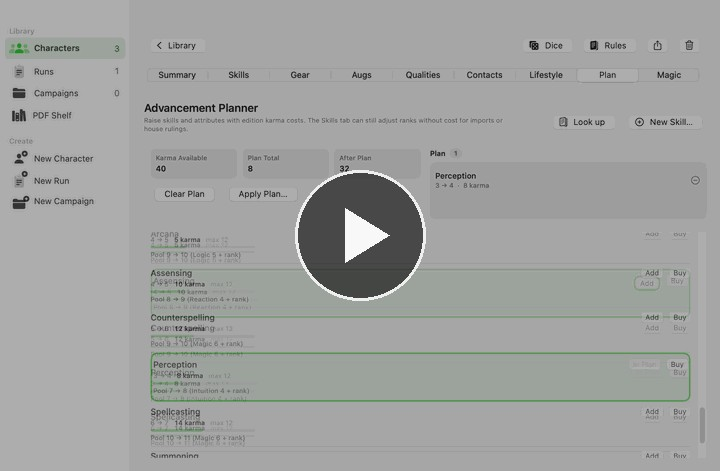<br />
          <sub><strong>▶ Advancement Planner</strong> — plan skill and attribute raises, apply karma, watch ranks update</sub>
        </summary>
        <p align="center">
          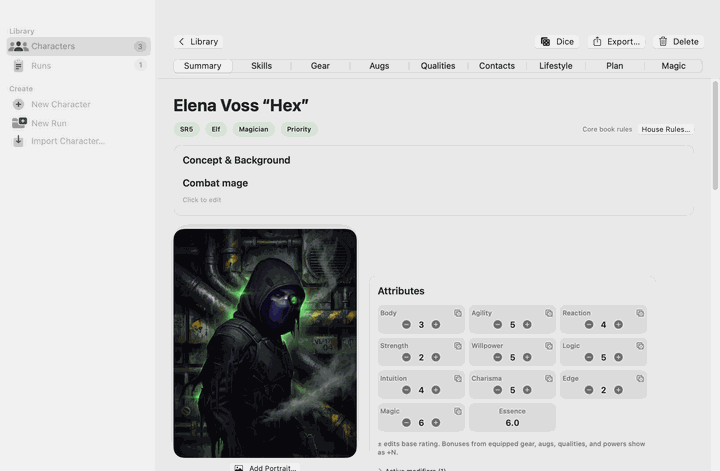
        </p>
      </details>
    </td>
  </tr>
</table>

---

## Features

### Build a runner

- **Edition-aware generation** for SR4, SR5, and SR6
- Guided wizard: metatype, priorities, attributes, skills, qualities, resources, magic/resonance
- **House rules** — Sum-to-Ten, free knowledge, expanded contacts, prime runner packages, **dice rules** (glitch threshold, Rule of Six, hits on 4+, and more)
- Role recommendations and painted archetype / metatype art

### Character library & play sheet

<table>
  <tr>
    <td width="42%" valign="top">
      <a href="Screenshots/04-character-sheet.jpg">
        
      </a>
    </td>
    <td width="58%" valign="top">

- Local library with **search**, **list** and **gallery** views
- Interactive **Summary**: portrait, attributes (base + gear/aug bonuses), condition, karma, nuyen, initiative, armor, pools
- Tabs for **Skills**, **Gear**, **Augs**, **Qualities**, **Contacts**, **Lifestyle**, **Plan**, and **Magic**
- **Portraits** — static images or multi-frame GIFs
- **Dice roller** (⌘D) — trailing inspector; roll from skills or attributes; Push the Limit &amp; Second Chance; optional house-rule dice math

    </td>
  </tr>
</table>

### Runs / mission tracker

<table>
  <tr>
    <td width="58%" valign="top">

- **Run Library** — filter by status, character, and **ruleset**
- Briefing: client, location, tags, objectives, opposition, complications
- **Team** limited to library characters that match the run’s ruleset
- Session log, payout &amp; heat, outcome notes, suggested equal-split awards
- **Apply Awards…** — explicit commit of nuyen + karma to linked runners (never automatic)

    </td>
    <td width="42%" valign="top" align="center">
      <a href="Screenshots/07-run-mission-flow.gif">
        
      </a><br />
      <sub>Expand the tour poster above to play the full flow</sub>
    </td>
  </tr>
</table>

### Rules Reference & PDF library

A dedicated window (⌘R) with two modes — mechanical cards for the table, and your own PDF shelf for books you own.

<table>
  <tr>
    <td width="50%" align="center" valign="top">
      <a href="Screenshots/06-rules-reference.jpg">
        
      </a><br />
      <sub><strong>Reference</strong> — searchable cards, formulas, edition notes, calculators</sub>
    </td>
    <td width="50%" align="center" valign="top">
      <a href="Screenshots/09-pdf-library.jpg">
        
      </a><br />
      <sub><strong>Library</strong> — personal PDF shelf (sample books in marketing shots; yours stay local)</sub>
    </td>
  </tr>
</table>

| Mode | What you get |
|------|----------------|
| **Reference** | Searchable **mechanical cards** (dice, karma, lifestyle, combat, magic, matrix, …) with short original summaries, formulas, edition notes, and compact calculators (Drain, Overwatch, glitch threshold, lifestyle burn, …) |
| **Library** | Your **personal PDF shelf** — add rulebooks you own (drag-drop or Add PDF…), gallery/list by section, covers, continuous reader, find-in-document, thumbnails, and per-book **page offset** for front matter |

**Page chips** on cards (e.g. “SR5 CRB p. 44”) open the bound PDF at the correct page when you assign a **book key** in Book settings. No rulebook PDFs are bundled or redistributed — only local files you add.

### Lifestyle, advancement & more

| Area | Highlights |
|------|------------|
| **Lifestyle** | Monthly cost, prepaid months, **reserve** (spent first), Process Month (1–3 mo), prepay, short payment ledger |
| **Advancement** | Edition karma costs, plan cart, Buy Now / Apply Plan, suggestions, spend ledger |
| **Contacts** | Tags, favor standing, interaction log, optional soft run links |
| **Import** | Chummer JSON / `.chum5`, `.shadowdeck` — sidebar, File menu (⌘O), drag-and-drop, Finder double-click |
| **Export** | PDF character sheet, Chummer `.chum5` (original payload when available), portable `.shadowdeck` package |
| **Catalog** | Bundled **SR5** reference catalog; equipping gear/augs/qualities updates the play sheet |

---

## Getting started

1. Download a [**Release**](https://github.com/RcktMan77/ShadowDeck/releases), **or** open **ShadowDeck.xcodeproj** in Xcode 16+ and Run, **or** build with `Scripts/release_build.sh`.
2. **Create → New Character** (⌘N), **Import Character…** (⌘O), or **Load Samples** from the Character Library.
3. Open a character for the play sheet; use **Dice** (⌘D) or the dice control on a skill/attribute to roll.
4. **Rules Reference…** (⌘R) for mechanical cards, calculators, and your PDF shelf.
5. **Create → New Run** (⌘⇧R) or **Library → Runs** for missions.

### Sidebar

| Section | Items |
|---------|--------|
| **Library** | Characters · Runs |
| **Create** | New Character · Import Character… · New Run · New Run from Template · New Campaign |

### Requirements

- **macOS 14.0** or later
- Development: **Xcode 16+**

---

## Tips for the table

- Profile fields (attributes, gear equip, contacts) **save as you go**.
- Rich-text notes include a format toolbar; **⌘B / ⌘I / ⌘U** work while editing.
- **Lifestyle** is never auto-charged; process months only when you choose.
- **Plan** spends `karmaAvailable` with edition (and house-rule) costs; Skills can still adjust ranks freely for imports/GM fiat.
- **House Rules…** on the character identity area apply after chargen and feed validation, essence, and the **dice roller**.
- Run **Apply Awards…** (on a Completed/Failed run) credits equal-split nuyen and karma to linked runners with a confirmation sheet; it is never automatic.
- In **Rules Reference → Library**, open a book → **Book settings** to set shelf section, **book key** (so page chips resolve), and front-matter **page offset**.
- Re-import a Chummer file once if you need **byte-faithful** `.chum5` re-export of the original payload.

---

## Roadmap

Guiding principle: **deepen existing campaign tools** and high-frequency play aids before large multi-user work.

| Priority | Feature | Why | Effort |
|----------|---------|-----|--------|
| **Done** | **Rules Reference** | Mechanical cards, calculators, personal PDF shelf, page-chip deep links (⌘R) | — |
| **1** | **Run Tracker Phase 2** | Templates, stronger contact links from runs, outcome flow, open threads; custom award shares | Medium |
| **2** | **Multi-domain initiative / combat tracker** | Major GM aid; better after the core loop is polished | Larger |
| **3** | **Shared Hub (multi-user)** | Most ambitious; after the single-user experience is solid | Large |

---

## For developers

| Doc | |
|-----|--|
| Branching | [Docs/BRANCHING.md](Docs/BRANCHING.md) |
| Design | [Docs/DESIGN.md](Docs/DESIGN.md) |
| Chummer import | [Docs/CHUMMER_IMPORT.md](Docs/CHUMMER_IMPORT.md) |
| Screenshot pipeline | [Screenshots/README.md](Screenshots/README.md) |

```bash
# Debug build
xcodebuild -project ShadowDeck.xcodeproj -scheme ShadowDeck \
  -destination 'platform=macOS' build

# Tests
xcodebuild -project ShadowDeck.xcodeproj -scheme ShadowDeck \
  -destination 'platform=macOS' test

# Unsigned Release app → build/Release/ShadowDeck.app
Scripts/release_build.sh

# Refresh README marquees (stills, GIFs, posters → Screenshots/)
Scripts/capture_readme_screenshots.sh
```

Regenerate the bundled catalog from a Chummer `data/` folder:

```bash
python3 Scripts/build_catalog_from_chummer.py /path/to/Chummer/data
```

---

## License & content

ShadowDeck source code is made available for **personal, non-commercial use**.

**You may**
- View, download, and build the source for your own personal use
- Modify it for your own personal campaigns
- Submit pull requests or suggestions

**You may not**
- Sell, sublicense, or commercially redistribute the source code or compiled binaries derived from it
- Offer ShadowDeck (or a substantially similar product based on this codebase) as a paid service or commercial product without explicit written permission

### Rules text and PDFs

- Structured Rules Reference cards use **original concise summaries and formulas** only — not copied rulebook prose.
- Full rules remain the property of their respective publishers (e.g. Catalyst Game Labs).
- The **PDF library** holds only files **you** add on this Mac; ShadowDeck does **not** ship, download, or redistribute rulebook PDFs.
- Bundled SR5 **catalog** data is attributed separately (see `Resources/Catalog/NOTICE.txt`).

Commercial licensing and future paid features (if any) will be handled separately.  
See the [LICENSE](LICENSE) file for the full terms.

### Credits

- Bundled catalog data derived from Chummer5a open data (GPL-3.0); see `ShadowDeck/Resources/Catalog/NOTICE.txt`
- Brand fonts: Orbitron / Rajdhani (SIL Open Font License) under `Resources/Fonts/`
- Splash and icon art are original generated assets for this fan tool

**Shadowrun** names and setting elements remain trademarks of their owners. Use this app for personal tabletop play; respect the rights of book publishers when importing your own materials.
