<p align="center">
  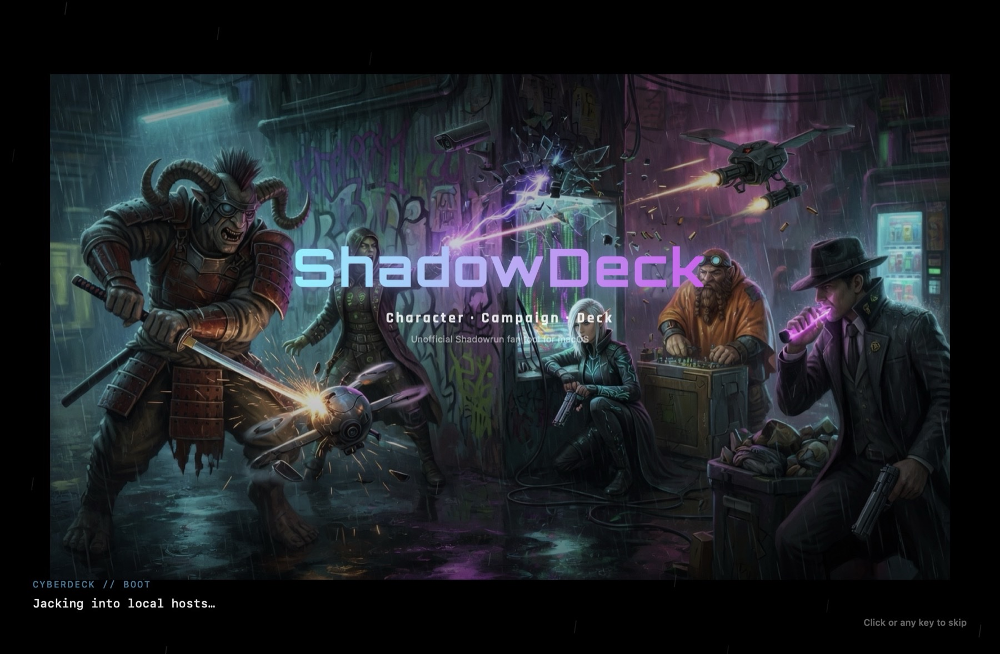
</p>

<h1 align="center">ShadowDeck</h1>

<p align="center">
  <strong>A native macOS companion for running Shadowrun campaigns</strong><br />
  Build runners · run the job · track lifestyle &amp; karma · roll dice<br />
  for <strong>4th, 5th, and 6th edition</strong>
</p>

<p align="center">
  <a href="https://github.com/RcktMan77/ShadowDeck/releases"></a>
  
  
  
  
  <a href="https://github.com/RcktMan77/ShadowDeck/releases"></a>
</p>

<p align="center">
  <em>Unofficial fan project — not affiliated with or endorsed by Catalyst Game Labs or The Topps Company, Inc.</em>
</p>

<p align="center">
  <a href="#tour">Tour</a> · <a href="https://github.com/RcktMan77/ShadowDeck/releases">Releases</a> · <a href="#license--content">License</a>
</p>

---

## Why ShadowDeck?

Chummer is still the go-to for deep character data. **ShadowDeck is built for the table** — sheets you can play from, jobs you can track, dice you can roll, and a rules shelf you control, all in one Mac app.

<p align="center"><sub>Solo · local-first · SR4 / SR5 / SR6 · Chummer import</sub></p>

<table>
  <tr>
    <td width="25%" align="center" valign="top">
      <strong>Characters</strong><br />
      <sub>Create, import, and play from a living sheet</sub>
    </td>
    <td width="25%" align="center" valign="top">
      <strong>Runs</strong><br />
      <sub>Plan jobs, brief the team, close out awards</sub>
    </td>
    <td width="25%" align="center" valign="top">
      <strong>Dice</strong><br />
      <sub>Hits, glitches, Edge, house-rule options</sub>
    </td>
    <td width="25%" align="center" valign="top">
      <strong>Rules</strong><br />
      <sub>Quick reference plus your own PDF shelf</sub>
    </td>
  </tr>
</table>

---

## Tour

<p align="center"><sub>Stills open full size. Expand a poster for a short GIF.</sub></p>

<table align="center">
  <tr>
    <td width="33%" align="center" valign="top">
      <a href="Screenshots/02-library.jpg">
        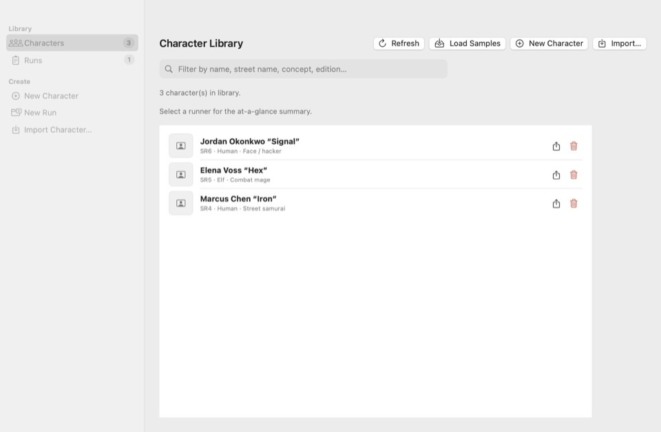
      </a><br />
      <sub><strong>Character Library</strong></sub>
    </td>
    <td width="33%" align="center" valign="top">
      <a href="Screenshots/03-generation-role.jpg">
        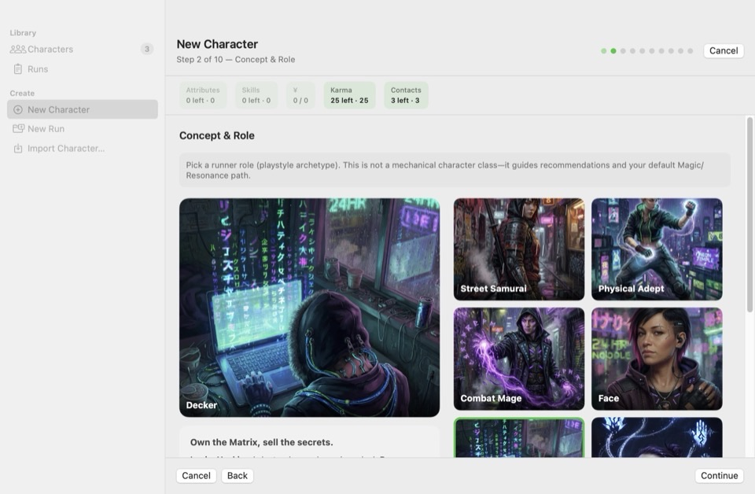
      </a><br />
      <sub><strong>New Character · Role</strong></sub>
    </td>
    <td width="33%" align="center" valign="top">
      <a href="Screenshots/04-character-sheet.jpg">
        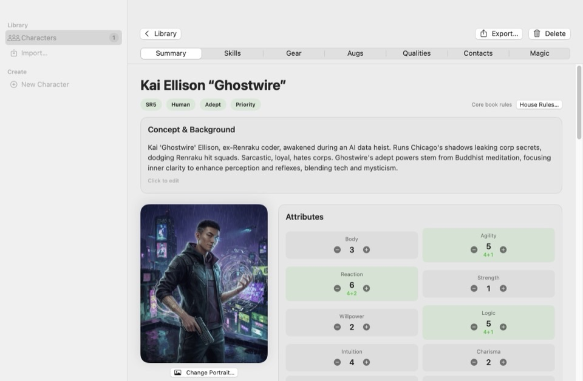
      </a><br />
      <sub><strong>Play sheet</strong></sub>
    </td>
  </tr>
  <tr>
    <td width="33%" align="center" valign="top">
      <a href="Screenshots/05-dice-roller.jpg">
        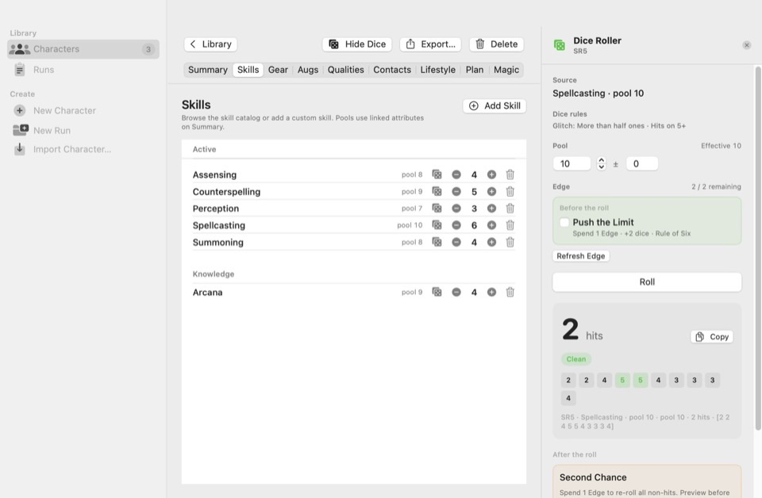
      </a><br />
      <sub><strong>Dice roller</strong></sub>
    </td>
    <td width="33%" align="center" valign="top">
      <a href="Screenshots/06-rules-reference.jpg">
        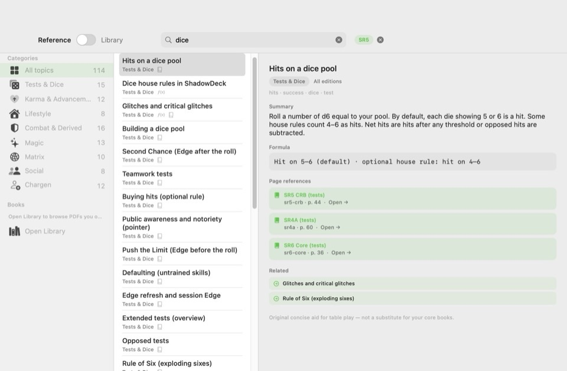
      </a><br />
      <sub><strong>Rules Reference</strong></sub>
    </td>
    <td width="33%" align="center" valign="top">
      <a href="Screenshots/09-pdf-library.jpg">
        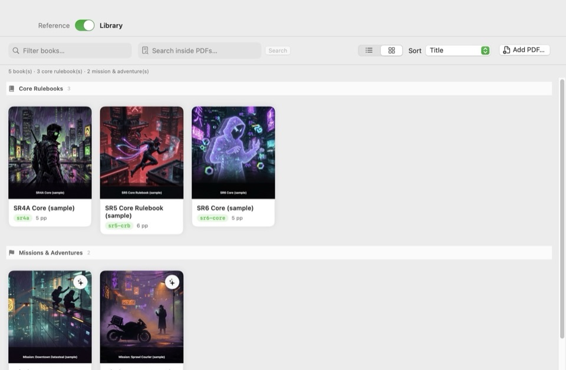
      </a><br />
      <sub><strong>PDF Library</strong></sub>
    </td>
  </tr>
</table>

<table align="center">
  <tr>
    <td width="50%" align="center" valign="top">
      <details>
        <summary>
          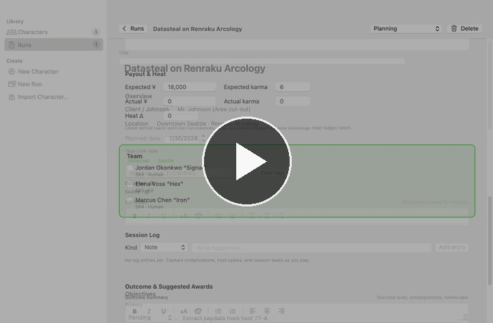<br />
          <sub><strong>▶ Run / mission flow</strong> — create a job, brief the team, log the session, complete objectives, set the outcome</sub>
        </summary>
        <p align="center">
          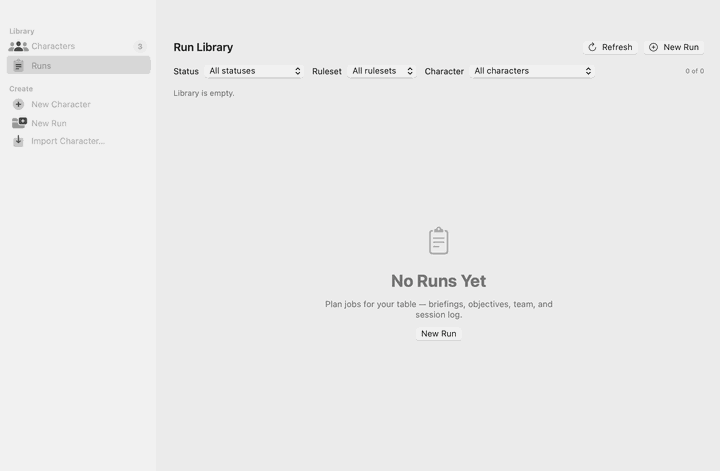
        </p>
      </details>
    </td>
    <td width="50%" align="center" valign="top">
      <details>
        <summary>
          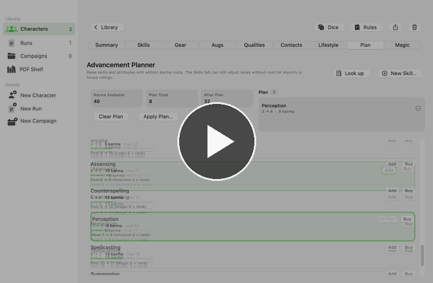<br />
          <sub><strong>▶ Advancement Planner</strong> — plan skill and attribute raises, apply karma, watch ranks update</sub>
        </summary>
        <p align="center">
          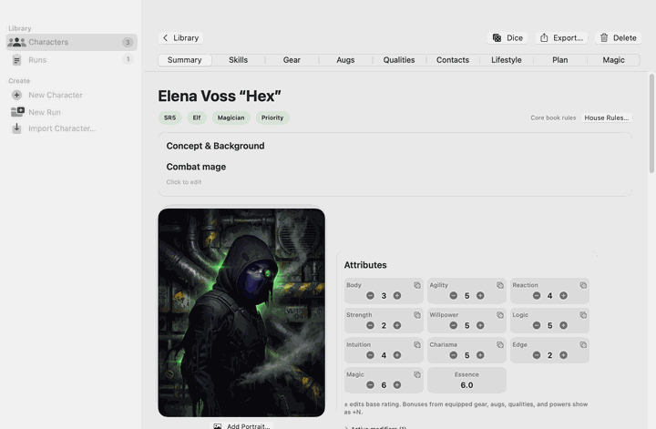
        </p>
      </details>
    </td>
  </tr>
</table>

---

## Features

### Build a runner

You can build a runner for Shadowrun 4th, 5th, or 6th edition.

- Fourth edition uses a 400-point Build Point ledger (metatype, attributes, skills, groups, spells, contacts, qualities, and nuyen).
- Fifth and sixth edition use priority tables, with Sum-to-Ten or karmagen available as house rules.
- You can turn on house rules for priorities, contacts, dice, and more.
- Role suggestions come with archetype and metatype art.
- You can bring in a runner from Chummer or from a portable package.

### Character library & play sheet

<p align="center">
  <a href="Screenshots/04-character-sheet.jpg">
    
  </a>
</p>

Keep a stable of runners ready for the next session — open a sheet, see the numbers that matter, and roll when it counts.

- You can search the library of characters you have saved.
- The play sheet shows attributes, condition, karma, nuyen, pools, and the bonuses that come from gear.
- Skills, gear, contacts, lifestyle, magic, and advancement all live on that same runner.
- A portrait can be a still image or an animation.
- Rolls start from the sheet (⌘D). Fourth and fifth edition support Push the Limit and Second Chance. Sixth edition uses Edge Actions by default (Add Edge Dice, Reroll Failures, Buy a Hit, Close Call). A house rule can restore a simpler, fifth-edition-style Edge pool.
- Gear and quality catalogs follow the character’s edition: an SR4A supplement pack (2,445 entries), a large SR5 set derived from Chummer (4,197), and an SR6 core pack (195).

### Runs / mission tracker

Track the full campaign loop: group jobs under a campaign, plan the run, put people on it, play the session, then close out and brief the table.

- You can keep related jobs under a campaign, with notes, blank runs, or a template you reuse.
- The roster holds the team, plus the Johnson, the fixer, and anyone the run is aimed at.
- While you play, you track objectives, the log, payouts, heat, and where the job stands.
- When you close out, you apply nuyen, karma, and reputation yourself. The handout the players see stays free of GM spoilers.
- You can draft a planning run from a mission PDF on your shelf. When Apple Intelligence is available on the Mac, an on-device model fills the fields; otherwise a text heuristic does. Either way, you review the draft before it becomes a run.

<p align="center">
  <a href="Screenshots/07-run-mission-flow.gif">
    
  </a>
</p>

### Rules Reference & PDF library

The same window holds a searchable card reference and a shelf for PDFs you add yourself. ShadowDeck does not ship rulebooks.

<table>
  <tr>
    <td width="50%" align="center" valign="top">
      <a href="Screenshots/06-rules-reference.jpg">
        
      </a><br />
      <sub><strong>Reference</strong> — searchable cards, formulas, edition notes, calculators</sub>
    </td>
    <td width="50%" align="center" valign="top">
      <a href="Screenshots/09-pdf-library.jpg">
        
      </a><br />
      <sub><strong>Library</strong> — personal PDF shelf (sample books in marketing shots; yours stay local)</sub>
    </td>
  </tr>
</table>

### Lifestyle, advancement & more

| Area | What it helps with |
|------|---------------------|
| **Lifestyle** | Monthly costs, reserves, and downtime upkeep when you decide to process a month |
| **Advancement** | Plan and spend karma on raises with edition-aware costs |
| **Contacts** | Standing, tags, and a log of favors and meetings |
| **Import / export** | Bring characters in from Chummer; export sheets and portable packages |
| **Catalog** | Edition-scoped gear and quality packs (SR4A, SR5, SR6) that update the sheet when you equip them |

---

## Getting started

[**Download the latest release**](https://github.com/RcktMan77/ShadowDeck/releases)

1. Install the release, or build from source.
2. Create a character (⌘N), import one (⌘O), or load samples from the library.
3. Open a runner’s play sheet and roll with **Dice** (⌘D).
4. Open **Rules Reference** (⌘R) for quick rules, or **PDF Shelf** (⌘⇧L) for your books.
5. When you are ready for the next job, create a campaign or a new run (⌘⇧R).

**Requirements:** macOS 14.0 or later.

---

## Tips for the table

- Edits save as you work; there is no separate commit step for the sheet.
- Lifestyle charges and run awards apply only when you choose them.
- House rules on a character shape validation, essence, and dice for that runner.
- The player briefing is what the team is allowed to know. Keep GM spoilers off that handout.
- Bind your own rulebooks when you want a reference card to open the right page in your PDF.
- In notes, ⌘B, ⌘I, and ⌘U turn bold, italic, and underline on and off.

---

## Roadmap

Focus: deepen solo campaign tools before multi-user play.

**Shipped:** Rules Reference, the campaign and run loop, and character generation for 4e–6e.

**Next:** a combat and initiative tracker.

**Later:** Shared Hub, and polish on the experimental PDF draft.

---

## For developers

Xcode 16 is the project-format minimum. Continuous integration uses Xcode 26.3. Local development uses Xcode 27.

```bash
# Debug build
xcodebuild -project ShadowDeck.xcodeproj -scheme ShadowDeck \
  -destination 'platform=macOS' build

# Tests
xcodebuild -project ShadowDeck.xcodeproj -scheme ShadowDeck \
  -destination 'platform=macOS' test

# Release configuration app
xcodebuild -project ShadowDeck.xcodeproj -scheme ShadowDeck \
  -configuration Release -destination 'platform=macOS' build

# Notarized zip. Reads CODESIGN_IDENTITY and SHADOWDECK_NOTARY_PROFILE from the environment.
Scripts/release_build.sh --zip --sign --notarize
```

Bundled catalogs live under `ShadowDeck/Resources/Catalog/` (`sr4_catalog.json`, `sr5_catalog.json`, `sr6_catalog.json`).

---

## License & content

ShadowDeck source is for **personal, non-commercial use**.

**You may** view, build, and modify it for your own campaigns, and submit pull requests.

**You may not** sell or commercially redistribute the source or binaries, or offer a substantially similar product as a paid service, without written permission.

### Rules text and PDFs

- Rules Reference cards use **original short summaries and formulas**, not copied rulebook prose.
- Full rules stay with their publishers (e.g. Catalyst Game Labs).
- The PDF library holds **only files you add**; ShadowDeck does not ship or redistribute rulebooks.
- Bundled SR5 catalog data is attributed in [`ShadowDeck/Resources/Catalog/NOTICE.txt`](ShadowDeck/Resources/Catalog/NOTICE.txt).

See [LICENSE](LICENSE) for full terms. Commercial licensing, if any, would be handled separately.

### Credits

- Catalog data derived from Chummer5a open data (GPL-3.0); see [`ShadowDeck/Resources/Catalog/NOTICE.txt`](ShadowDeck/Resources/Catalog/NOTICE.txt)
- Brand fonts: Orbitron / Rajdhani (SIL OFL) under `ShadowDeck/Resources/Fonts/`
- Splash and icon art are original assets for this fan tool

**Shadowrun** names and setting elements remain trademarks of their owners. Use ShadowDeck for personal tabletop play, and respect publishers’ rights when importing your own materials.
